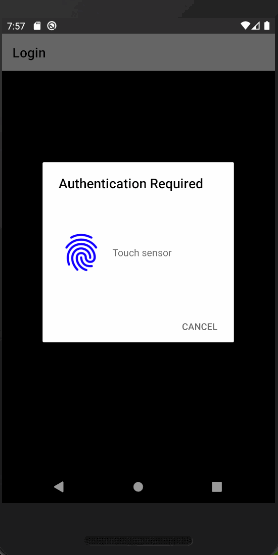

## Sobre o Projeto

Projeto para estudo sobre touch id.

### Feito Com

Abaixo segue o que foi utilizado na criação deste projeto:

- [React Native](http://facebook.github.io/react-native/) - O React Native é um framework que permite o desenvolvimento de aplicações mobile usando JavaScript e React;
- [React Navigation](https://reactnavigation.org/) - O React Navigation surgiu da necessidade comunidade do React Native de uma navegação de forma fácil de se usar, e escrita toda em JavaScript;

### Pré-requisitos

Ambiente configurado para criar e testar aplicativos em React Native, para isso você pode seguir o guia do link abaixo:

[Ambiente React Native (Android/iOS)](https://github.com/Rocketseat/ambiente-react-native)
